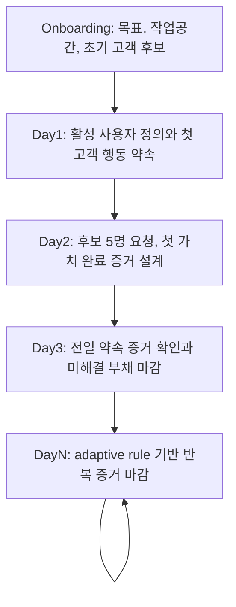

# Agentic30 Office Hours 재설계 v1

## 요약

Agentic30 Office Hours v1의 새 역할은 조언 시간이 아니라 증거 마감 시스템이다. 핵심 정의는 다음과 같다.

> 오늘의 가장 좁은 외부 검증 행동을 정하고, 고객 증거 또는 명시적 미해결 부채로 Day를 닫는 시스템.

이 문서는 Wave 1 초안을 통합해 Office Hours를 `증거 마감 편집자 / 시장 검증 운영자`로 재정의한다. 목표는 전업 1인 개발자가 30일 안에 활성 사용자 100명과 첫 매출 가능성을 고객 증거로 판단하도록 돕는 것이다. 근거는 `README.md`, `docs/SPEC.md`, `docs/specs/agentic30-30day-adaptive-program.md`, `.agentic30/*` 상태 파일, `sidecar/*` 상태/규칙 모듈에서 온다.

설계의 핵심 전환은 세 가지다.

- 질문의 목적지는 더 나은 생각이 아니라 오늘 실행할 고객 접촉, 관찰, 요청, 게시, 결제 확인이다.
- Day close는 고객 증거, posted URL, 또는 명시적 blocked/carry 상태 중 하나로만 가능하다.
- 현재 구현이 제공하지 않는 mandatory BIP, source 자동화, market radar 카드, execution 완료는 완료된 기능으로 주장하지 않는다.

## 현재 증거 스냅샷

현재 상태는 설계 목표와 구현 현실을 분리해 읽어야 한다.

| 항목 | 현재 증거 | 설계 해석 |
|---|---|---|
| 제품 목표 | Agentic30은 30일 안에 활성 사용자 100명과 첫 매출 가능성을 검증하게 하는 local-first macOS assistant다. 근거: `README.md`, `docs/SPEC.md`. | Office Hours는 내부 생산성보다 고객 증거를 우선해야 한다. |
| Day 1 | `onboarding`, `scan`, `goal`은 done이고 `first_interview`는 active다. Day 1 목표는 핵심 활성 행동을 끝낸 사용자 100명이며, 활성 사용자 기준은 "첫 가치 완료"로 좁혀졌다. 근거: `.agentic30/day-progress.json`, `.agentic30/memory/office-hours-turns.json`. | Day 1은 활성 사용자 정의와 첫 고객 행동 약속을 닫는 날이다. |
| proof sink | 현재 `.agentic30/day1-goal.json`의 `proofSink`는 `local`이고 코드 허용값은 `local`, `bip_optional`이다. 근거: `sidecar/day1-goal-state.mjs`. | mandatory BIP는 현재 구현 상태가 아니라 v1 설계 요구다. |
| Day 2 | `scan`, `retro`, `goal`, `interview`는 done이고 `execution`은 pending이다. 고객은 첫 매출 전 1인 개발자, 현재 대안은 제품 개선 반복, 요청은 고객 확보 계획 입력 요청으로 좁혀졌다. | Day 2는 실행 완료로 쓰지 않고, 실제 발송/완료/거절 증거를 요구한다. |
| Day 3 | `scan`, `retro`, `goal`은 done, `interview`는 active, `execution`은 pending이다. turn log에는 "고객요청 확정 캡처가 있다"가 있으나 ledger에는 open commitment와 `evidence: null`이 남아 있다. | Day 3는 상태 동기화가 아니라 증거 귀속 부채를 먼저 닫아야 한다. |
| 외부 소스 | daily digest의 git, GitHub CLI, PostHog, Cloudflare는 missing이다. 근거: `.agentic30/office-hours-daily-digest.json`. | 자동 수집 증거가 없으면 추정하지 않고 수동 증거 제출로 fail-closed 한다. |
| market radar | radar snapshot은 ready지만 모든 lane이 weak confidence이고 cards가 없다. 근거: `.agentic30/news/market-radar-cache.json`. | 시장 레이더는 검증된 추천이 아니라 약한 가설을 확인하는 보조 입력이다. |
| BIP Research Radar | News Market Radar와 별도인 공개 소셜 고객 후보 리서치 표면이다. 캐시 경로는 `.agentic30/bip/research/day-N-cache.json`이고 현재 작업공간에서는 ready BIP research cache가 발견되지 않는다. 근거: `sidecar/bip-research-radar.mjs`. | BIP research candidates는 ready BIP research cache가 있을 때만 사용한다. 없으면 수동으로 이름이 있는 도달 가능한 고객 1명을 사용자가 고르게 하고, radar 후보 보유처럼 표현하지 않는다. |
| adaptive gate | G1은 open이고 AR-02는 strong interview 0/3으로 fired 상태다. 근거: `.agentic30/gate-ledger.json`. | Office Hours는 인터뷰 부족을 오늘의 외부 행동으로 회복해야 한다. |

## 새 역할 정의

Office Hours v1은 `증거 마감 편집자 / 시장 검증 운영자`다. 기존 Garry Tan style 6대 강제질문이 demand reality, status quo, desperate specificity, narrowest wedge를 좁히는 장점은 유지한다. 차이는 종료 조건이다. v1은 질문을 Premise Challenge로 끝내지 않고 고객 증거 또는 명시적 미해결 부채로 Day를 닫는다.

Office Hours가 반드시 하는 일:

- 현재 상태에서 가장 약한 시장 가정을 하나 고른다.
- 그 가정을 오늘 실행 가능한 가장 좁은 외부 검증 행동으로 번역한다.
- 고객, 채널, 요청 문장, 기대 증거, 마감 조건을 한 묶음으로 고정한다.
- 고객 증거가 없으면 성공으로 닫지 않고 blocked 또는 carry로 남긴다.
- user-origin commitment만 약속으로 취급하고, 모델이 만든 약속을 고객 부채로 승격하지 않는다.

Office Hours가 거부하는 일:

- 긴 전략 조언, 위로형 코칭, 추상 고객 정의로 세션을 끝내는 것.
- 관심, 칭찬, waitlist, 가격 질문만으로 수요가 검증됐다고 말하는 것.
- 코드 변경, 문서 정리, 제품 개선을 고객 증거 대신 인정하는 것.
- 자동 게시, 자동 영업, 자동 인터뷰 완료처럼 사용자가 하지 않은 외부 행동을 완료로 기록하는 것.

## 전체 흐름

운영 순서는 매일 동일하다.

1. 전일 commitment와 carry를 먼저 확인한다.
2. 현재 evidence gap을 하나 고른다.
3. 오늘의 외부 행동을 고객, 채널, 메시지, 증거 형식까지 좁힌다.
4. BIP 초안을 한국어로 만들고 사용자가 승인/수정한다.
5. Day close는 posted URL, 고객 증거, blocked, carry 중 하나로만 기록한다.

## Day 1 상세 흐름과 종료 조건

Day 1의 목적은 "100명"을 가입자나 관심자가 아니라 `첫 가치 완료` 기준의 활성 사용자로 고정하고, 첫 고객 행동 약속을 user-origin commitment로 남기는 것이다.

진입 입력:

- 온보딩에서 확인한 작업공간, 제품 목적, 30일 목표.
- 현재 목표: 30일 안에 핵심 활성 행동을 끝낸 사용자 100명.
- 현재 goal type: `get_users`.
- 아직 넓은 고객/problem과 `proofSink: local` 상태.
- Day 1 상태: `onboarding=done`, `scan=done`, `goal=done`, `first_interview=active`.

프롬프트 흐름:

1. 활성 사용자 기준을 "첫 가치 완료"로 재진술한다.
2. 이번 주 실제로 연락 가능한 고객 후보 또는 좁은 세그먼트를 고른다.
3. 그 고객의 현재 대안, 시간 비용, 돈 비용, 실패 비용을 묻는다.
4. 오늘 할 외부 행동을 고객 후보 1명 요청, 관찰 1회, 거절 이유 확보, 작은 유료 조건 확인 중 하나로 좁힌다.
5. 첫 가치 완료 기준을 한 문장으로 확정한다.
6. 사용자가 직접 다음 고객 행동 또는 실행 불가 사유를 적어 `first_interview`를 닫는다.

종료 조건:

- close 가능: 고객 후보, 요청 문장, 오늘 확인할 증거 형식이 포함된 user-origin commitment가 있다.
- 성공 증거: 실명 고객 후보, 보낸 요청, 화면 관찰 메모, 첫 가치 완료 캡처 또는 URL, 거절 이유와 현재 대안 기록.
- blocked close: 대상 없음, 요청 문장 없음, 증거 저장 위치 없음처럼 다음 Day의 첫 질문으로 바꿀 수 있는 차단 사유가 있다.
- close 불가: "좋아 보인다", "나중에 하겠다", "기능을 더 만들겠다"처럼 외부 고객 행동이 없는 답변.

carry 조건:

- 고객 후보가 없으면 Day 2는 후보 5명 기준부터 시작한다.
- 요청 문장이 없으면 Day 2는 실제로 보낼 한 문장부터 시작한다.
- 첫 가치 완료 기준이 흐리면 Day 2는 활성 사용자 계수 기준을 다시 묻는다.
- 증거 위치가 없으면 Day 2는 캡처, URL, 메시지 로그, 관찰 메모 중 하나를 고정한다.

## Day 2 상세 흐름과 종료 조건

Day 2의 목적은 Day 1의 약속을 실제 외부 요청과 첫 가치 완료 증거로 바꾸는 것이다. 현재 Day 2 `execution`은 pending이므로 실행 완료를 주장하지 않는다.

진입 입력:

- Day 2 상태: `scan=done`, `retro=done`, `goal=done`, `interview=done`, `execution=pending`.
- 선택된 외부 행동: 고객 후보 5명에게 사용 요청.
- 좁힌 고객: 첫 매출을 아직 못 만든 1인 개발자.
- 현재 대안: 제품 개선만 반복.
- 요청 모양: 현재 제품과 고객 확보 계획 입력 요청.
- activation gate: 오늘 보낼 고객 요청 1개 확정.
- 성공 증거: 첫 가치 완료 1명 이상.

프롬프트 흐름:

1. Day 1의 고객 후보, 요청 문장, 완료 기준, 증거 위치 공백을 확인한다.
2. 고객 후보 5명 요청을 기본값으로 두고, 화면 공유 관찰, 작은 유료 진입점, 현재 대안 비용 확인 중 더 강한 증거가 있으면 선택한다.
3. 고객을 실제 행동 압력이 있는 세그먼트로 좁힌다.
4. 제품 개선 반복이라는 현재 대안을 고객 언어로 확인한다.
5. 실제 보낼 요청 문장을 한 문장으로 확정한다.
6. 입력 완료가 아니라 "오늘 보낼 고객 요청 1개 확정"처럼 외부 행동으로 이어지는 끝 행동을 정한다.
7. 완료자 이름, 완료 시각, 확정 요청, 막힌 단계를 남길 형식을 정한다.

종료 조건:

- close 가능: 고객 후보 5명에게 요청이 실제로 발송되고, 최소 1명이 첫 가치 완료를 끝냈거나, 완료 실패 이유와 다음 행동이 증거로 남았다.
- 성공 증거: 완료자 이름, 완료 시각, 첫 가치 완료 화면 캡처 또는 URL, 확정한 고객 요청, 막힌 단계 기록.
- 부분 close: 사용 약속 3명 이상, 거절 이유 3개 이상, 작은 유료 진입점 응답 1개 이상. 단, 활성 사용자 증가로 계산하지 않고 다음 Day 입력으로만 쓴다.
- blocked close: 보내지 못한 이유, 후보 이름 부재, 요청 문장 부재, 응답 없음, 오늘 완료자 없음 중 하나가 명시된다.

carry 조건:

- 완료자가 0명이면 Day 3는 후보 1명을 고정해 화면 관찰 또는 재요청으로 좁힌다.
- 발송은 했지만 완료가 없으면 Day 3는 거절 이유, 막힌 단계, 현재 대안 비용 중 하나를 고른다.
- 캡처나 URL이 없으면 자기보고를 증거로 인정하지 않고 확인 가능한 증거 확보를 첫 행동으로 둔다.
- 완료자가 있어도 반복 가능성이 불명확하면 다음 요청, 완료자 후속 행동, 화면 관찰 중 하나를 고른다.

## Day 3+ Adaptive Capability Map

Day 3 이후 Office Hours는 매일 같은 질문을 반복하지 않는다. 현재 신호를 읽고 가장 큰 증거 공백을 하나의 capability로 선택한다.

| Capability | 사용하는 상황 | Office Hours의 역할 |
|---|---|---|
| 커밋먼트 부채 회수 | open commitment가 있고 `evidence: null`인 경우 | 새 약속보다 기존 약속을 met, missed, blocked, carry 중 하나로 먼저 닫게 한다. |
| 인터뷰 쿼터 회복 | AR-02 fired, strong interview 0/3 | ready BIP Research Radar cache가 있으면 후보를 쓰고, 없으면 수동으로 이름이 있는 도달 가능한 고객 1명을 고정한다. |
| 고객 증거 없는 빌드 리디렉션 | 빌드 활동은 있는데 고객 접촉 증거가 없는 경우 | 빌드 미션을 고객 접촉 미션으로 치환한다. |
| 약한 증거 에스컬레이션 | self-report나 계획만 반복되는 경우 | URL, 캡처, 고객 답장, 결제 의향 같은 hard evidence를 요구한다. |
| carry-over 분해 | 같은 행동이 반복 이월되는 경우 | 행동을 수신자, 문장, 채널, 마감 시간으로 쪼갠다. |
| 트래픽 0 채널 액션 | 배포 URL과 방문 0 신호가 확인될 때 | 채널 1개와 첫 게시/DM 행동을 고른다. |
| 매출 퍼널 끊김 복구 | 결제 의향은 있으나 결제가 없는 경우 | 가격, 패키지, 결제 경로 중 병목 하나를 검증한다. |
| 버려진 약속 차단 | 증거 없는 약속 위에 새 약속을 쌓는 경우 | 새 commitment 생성을 막고 기존 약속을 먼저 닫는다. |
| 정체 진행 회복 | 앱은 활성인데 Day progress가 멈춘 경우 | 1-step mission과 저녁 리마인더로 복귀시킨다. |
| source-unavailable fallback | 외부 자동 소스가 missing/null인 경우 | 없는 데이터를 추정하지 않고 수동 증거 제출을 요구한다. |
| 약한 News Market Radar fallback | `.agentic30/news/market-radar-cache.json`이 ready지만 weak confidence/no cards인 경우 | 추천이 아니라 확인 질문으로만 사용한다. |
| BIP Research Radar 후보 fallback | `.agentic30/bip/research` 아래 ready candidate cache가 없는 경우 | radar 후보 3명을 발명하지 않고 수동으로 이름이 있는 도달 가능한 고객을 요구한다. |
| BIP close loop | 오늘의 외부 행동이 정해진 경우 | 자연스러운 한국어 초안을 만들고 posted URL 또는 blocked/carry로 Day를 닫는다. |

## Capability Input/Output/Action/Evidence Table

| Capability | Input | Output | Action | Evidence |
|---|---|---|---|---|
| 커밋먼트 부채 회수 | open commitment, `evidence: null`, Day 3+ 진입 | 오늘 닫을 미해결 고객 약속 1개 | 고객, 채널, 기대 증거를 재확인하고 가장 작은 1-step으로 재작성 | `sidecar/office-hours-memory.mjs`, `.agentic30/memory/office-hours-ledger.json` |
| 인터뷰 쿼터 회복 | AR-02, week 1, strong interview 0/3 | 오늘 필요한 인터뷰 요청 수 | `sidecar/bip-research-radar.mjs`의 ready BIP research cache가 있으면 후보 중 한 명에게 보낼 DM/Threads 요청을 고른다. 없으면 수동으로 이름이 있는 도달 가능한 고객 1명과 요청 문장을 먼저 고른다 | `.agentic30/gate-ledger.json`, `sidecar/adaptive-rules.mjs`, `.agentic30/bip/research/day-N-cache.json` |
| 고객 증거 없는 빌드 리디렉션 | AR-01, 고객 접촉 proof 부재 | 빌드 미션 중지 경고와 고객 접촉 미션 | 기능 추가 대신 문제/대안/가격을 묻는 메시지로 치환 | `sidecar/adaptive-rules.mjs`, `sidecar/daily-office-hours-digest.mjs` |
| 약한 증거 에스컬레이션 | AR-07, weak-only evidence 반복 | hard evidence 재제출 요구 | 자기보고를 거부하고 URL, 답장, 결제 의향, 인터뷰 기록 중 하나를 요구 | `sidecar/adaptive-rules.mjs`, proof-ledger strength |
| carry-over 분해 | AR-05, carry-over 입력 null 또는 수동 반복 정체 | 자동 발동 없음 또는 수동 분해 후보 | 행동을 수신자, 문장, 채널, 마감 시간으로 쪼갠다 | `sidecar/adaptive-rule-signals.mjs`, carry-over queue |
| 트래픽 0 채널 액션 | AR-08, Cloudflare available일 때 방문 0 | 채널 액션 1개 | 배포 URL과 방문 0 상태가 확인될 때 첫 포스트/DM을 만든다 | `sidecar/adaptive-rules.mjs`, Cloudflare source 상태 |
| 매출 퍼널 끊김 복구 | AR-14, payment intent와 payment record 간 단절 | 결제 병목 1개 | 가격 또는 결제 단계 하나를 바꿔 재요청한다 | `sidecar/adaptive-rules.mjs`, proof-ledger payment intent |
| 버려진 약속 차단 | AR-17, abandoned commitment와 새 commitment | 신규 약속 차단 | 기존 약속을 met/missed/blocked/carry로 먼저 분류한다 | `sidecar/office-hours-memory.mjs`, `sidecar/adaptive-rules.mjs` |
| 정체 진행 회복 | AR-19, app active와 day progress 정체 | 1-step mission | 오늘 닫을 가장 작은 외부 행동 하나를 만든다 | `sidecar/adaptive-rules.mjs`, day-progress state |
| source-unavailable fallback | git/GitHub/PostHog/Cloudflare missing 또는 null | 자동 판단 불가 표시 | URL, 스크린샷, 답장, 로그를 사용자에게 요구한다 | `.agentic30/office-hours-daily-digest.json`, `sidecar/adaptive-rule-signals.mjs` |
| 약한 News Market Radar fallback | radar ready, weak confidence, cards 없음 | 검증 질문 목록 | ICP, 문제, 가격, 채널별 확인 질문을 만든다 | `.agentic30/news/market-radar-cache.json` |
| BIP Research Radar 후보 fallback | ready BIP research cache 없음 | 수동 고객 후보 입력 | AR-02/BIP DM 흐름에서 radar 후보를 주장하지 않고 사용자가 실제 연락 가능한 고객을 이름으로 고르게 한다 | `.agentic30/bip/research`, `sidecar/bip-research-radar.mjs` |
| BIP close loop | 오늘의 외부 행동, 한국어 Threads 초안, 승인 상태 | close 가능/불가 판단 | 자동 게시 없이 사용자가 게시한 URL 또는 blocked/carry를 기록한다 | `sidecar/bip-prompt.mjs`, `sidecar/day1-goal-state.mjs` |

## Mandatory BIP Policy

Mandatory BIP는 현재 구현 완료 기능이 아니라 Office Hours v1의 Day close 계약이다. 현재 proof sink가 `local|bip_optional`이므로 이 정책은 구현 gap으로 표시해야 한다.

정책:

- Office Hours는 매일 하나의 자연스러운 한국어 Threads 초안을 만든다.
- 초안은 오늘 배운 것보다 "누구에게 무엇을 검증하러 가는가"를 드러내야 한다.
- 사용자는 초안을 승인하거나 직접 편집한다.
- 앱은 Threads, X, 기타 소셜 계정에 자동 게시하지 않는다.
- Day close에는 사용자가 직접 게시한 Threads URL 또는 동등한 공개 URL이 필요하다.
- 게시할 수 없으면 성공으로 닫지 않고 blocked 또는 carry 상태와 다음 행동을 남긴다.

Day close contract:

| Close type | 필요한 값 | 의미 |
|---|---|---|
| `posted_url` | Threads 또는 공개 게시물 URL | 사용자가 승인/편집 후 직접 게시했고 외부 검증 행동이 공개 흔적으로 남았다. |
| `blocked` | 차단 사유와 unblock 행동 | 오늘 게시 또는 고객 접촉이 외부 이유로 막혔다. |
| `carry` | 이어갈 행동과 더 작은 다음 step | 행동이 다음 Day로 이월되며 성공 증거로 계산하지 않는다. |

## Adaptive Rules

현재 MVP adaptive rule set은 AR-01, AR-02, AR-05, AR-07, AR-08, AR-14, AR-17, AR-19로 운영한다. 외부 자동 수집 신호가 없으면 fail-closed로 미발동해야 하며, 사용자가 false positive를 표시하면 cooldown을 적용한다.

| Rule | 의미 | Office Hours 동작 |
|---|---|---|
| AR-01 | 고객 증거 없이 빌드만 이어진다. | 오늘 미션을 빌드가 아니라 고객 접촉과 BIP 초안으로 바꾼다. |
| AR-02 | 주간 strong interview 쿼터가 부족하다. | 후보와 요청 문장을 먼저 고르고 인터뷰 요청을 오늘의 외부 행동으로 만든다. |
| AR-05 | 같은 행동이 3일 이상 carry-over 된다. | 자동 입력이 없으면 발동했다고 말하지 않고, 사용자가 반복 정체를 말할 때 작은 행동으로 분해한다. |
| AR-07 | 검증 가능한 증거 없이 weak evidence만 반복된다. | milestone 진행을 막고 URL, 캡처, 답장, 결제 신호 같은 hard evidence를 요구한다. |
| AR-08 | 배포 URL은 있으나 Cloudflare 유입이 0이다. | Cloudflare source가 available일 때만 채널 액션을 만든다. unavailable이면 수동 증거 제출로 전환한다. |
| AR-14 | 결제 의향과 실제 결제 기록 사이가 끊겼다. | 가격, 패키지, 결제 경로 중 하나를 검증하는 고객 행동으로 좁힌다. |
| AR-17 | 증거 없는 약속이 남아 있는데 새 약속을 쌓는다. | 기존 commitment가 닫히기 전 신규 commitment 생성을 막는다. |
| AR-19 | 앱은 활성인데 Day progress가 3일 이상 멈췄다. | 긴 회고 대신 오늘 닫을 1-step mission과 저녁 리마인더를 만든다. |

## 구현 힌트

이 설계는 문서 단계이며 UI mock, Swift diff, sidecar diff를 만들지 않는다. 구현 힌트는 제품 계약, schema, event surface, QA 영역만 가리킨다. 코드 모양은 각 파일의 기존 패턴을 따른다.

| 계약 영역 | 구현 표면 | 제품 계약 |
|---|---|---|
| Office Hours 질문 역할 | `sidecar/specialists/office-hours.mjs` | 현재 Garry Tan식 demand/wedge 질문을 버리지 말고, 종료 조건을 "Premise Challenge"에서 고객 증거 또는 명시적 부채 마감으로 바꾼다. 질문은 여전히 한 번에 한 결정만 묻고, 마지막에는 고객, 채널, 요청 문장, 기대 증거가 남아야 한다. |
| bridge / WebSocket 시작 계약 | `sidecar/index.mjs` | `office_hours_start`는 Day, source, trigger, visible prompt, 현재 context를 받아 Office Hours runtime을 시작하는 WebSocket bridge 표면이다. 새 Day close 정보가 생기면 기존 envelope와 schema versioning 관례를 유지하고, Swift surface와 sidecar가 같은 상태 이름을 읽도록 맞춘다. |
| Day progress 상태 | `sidecar/day-progress-state.mjs`, `sidecar/index.mjs` | `day_progress_state`는 Day 1의 `first_interview`와 Day 2+의 `interview`/`execution` 흐름을 보여주는 주 상태다. Day close type, blocked reason, carry next step, officeHoursMemory, evidenceOS는 같은 Day 기준으로 해석되어야 한다. |
| Day 1 목표와 proof sink | `sidecar/day1-goal-state.mjs`, `sidecar/index.mjs` | 현재 `proofSink` schema는 `local`과 `bip_optional`만 허용한다. mandatory BIP는 v1 설계 요구로 남기고, 구현 전에는 저장 상태나 UI 문구가 이미 mandatory라고 주장하지 않는다. |
| BIP Research Radar | `sidecar/bip-research-radar.mjs`, `sidecar/index.mjs` | News Market Radar와 다른 후보 리서치 표면이다. `.agentic30/bip/research/day-N-cache.json`이 ready일 때만 후보를 Office Hours/AR-02/BIP DM 흐름에 넣고, 없으면 수동으로 이름이 있는 도달 가능한 고객 fallback으로 간다. |
| Office Hours runtime prompt / structured input | `sidecar/office-hours-chat-prompt.mjs`, `sidecar/office-hours-structured-input.mjs` | 한국어 structured input 계약, Day 1 locked goal 흐름, Day 2+ goal-driven 흐름, active-user definition 우선 질문, 한 번에 하나의 card, 외부 검색/게시 전 승인 규칙을 보존해야 한다. |
| Office Hours memory와 commitment | `sidecar/office-hours-memory.mjs`, `sidecar/index.mjs` | user-origin `commitment`만 고객 약속으로 기록한다. 모델이 만든 초안, 추천, 정리 문장은 약속이 아니다. `evidence: null`인 open/missed/carry 부채는 Day 3+에서 먼저 닫을 후보로 올라와야 한다. |
| mission card / 실행 표면 | `sidecar/mission-card.mjs`, `sidecar/index.mjs` | `mission_card`는 Day 2+ 실행 표면으로, 인터뷰/액션 Day는 link 또는 file evidence와 medium 이상 strength를 요구한다. Office Hours가 만든 고객 행동은 미션 카드의 proof target과 충돌하지 않고 같은 증거 계약으로 이어져야 한다. |
| adaptive rule 판단 | `sidecar/adaptive-rules.mjs`, `sidecar/adaptive-rule-signals.mjs` | AR-01, AR-02, AR-05, AR-07, AR-08, AR-14, AR-17, AR-19는 source signal이 없으면 fail-closed로 둔다. fired rule, unavailable source, false positive label, cooldown은 사용자에게 서로 다른 상태로 보여야 한다. |
| intervention 표면 | `sidecar/oh-intervention.mjs`, `sidecar/index.mjs` | `office_hours_intervention_required` bridge event, fixed question set, exit condition, post-session evidence는 fail-closed로 유지한다. G1/AR-02/blocked/carry 문구가 바뀌면 intervention context와 pass-through token 조건이 같은 Day close 계약을 읽어야 한다. |
| BIP 초안과 Day close | `sidecar/bip-prompt.mjs`, `sidecar/index.mjs` | BIP는 자연스러운 한국어 초안과 사용자 승인/편집 계약이다. 앱이 자동 게시하지 않는다. Day close가 URL을 요구하더라도 현재 BIP prompt는 콘텐츠 생성 도구이므로 posted URL, blocked, carry 상태 저장은 별도 Day close 계약으로 봐야 한다. |
| revenue evidence | `sidecar/index.mjs`, `sidecar/adaptive-rules.mjs`, `sidecar/adaptive-rule-signals.mjs` | revenue evidence는 결제 기록, 결제 실패, 환불, 명시적 거절 같은 매출 퍼널 신호를 proof ledger와 adaptive rule 판단에 연결하는 제품 표면이다. 금액 원값보다 증거 locator, status, strength, amount band를 우선한다. |

테스트/QA 힌트:

- `sidecar-tests/request-emit.test.mjs`: `office_hours_start`, WebSocket bridge envelope, `day1_goal_state`, `day_progress_state`, `mission_card` emission, provider recoverable error, 중복 start idempotency를 확인하는 주 테스트 영역이다.
- `sidecar-tests/bip-research-radar.test.mjs`: BIP Research Radar cache path, provider/Exa unavailable state, ready candidate normalization, candidate source refs를 확인하는 주 테스트 영역이다. 이 테스트가 없는 ready cache는 Office Hours 후보 추천의 근거가 아니다.
- `sidecar-tests/office-hours-chat-prompt.test.mjs`, `sidecar-tests/office-hours-structured-input.test.mjs`: 한국어 Office Hours 질문 순서, structured input card contract, Day 1 locked goal, Day 2+ goal-driven 흐름, 외부 검색/게시 승인 문구를 확인하는 인접 테스트 영역이다.
- `sidecar-tests/office-hours-memory.test.mjs`: user-origin commitment, structured commitment confirmation, hard evidence grading, carry-forward, abandon, additive memory summary를 확인하는 주 테스트 영역이다.
- `sidecar-tests/mission-card.test.mjs`: mission card의 evidenceSpec, gate context, 실행/인터뷰 Day proof target이 Office Hours close 계약과 충돌하지 않는지 확인하는 직접 테스트 영역이다.
- `sidecar-tests/office-hours-evidence-state.test.mjs`: Evidence OS, hard evidence state, open debts, day close references가 BIP/manual candidate fallback 뒤에도 같은 의미로 조립되는지 확인하는 직접 테스트 영역이다.
- `sidecar-tests/adaptive-rules.test.mjs`: MVP rule set, threshold, fail-closed, false positive cooldown, AR-17 신규 commitment 차단을 확인하는 주 테스트 영역이다.
- `sidecar-tests/adaptive-rule-signals.test.mjs`: persisted store에서 revenue evidence, strong interview quota, weak-only evidence, stalled day progress, source unavailable 신호가 조립되는지 확인하는 주 테스트 영역이다.
- `sidecar-tests/bip-coach-state.test.mjs`: BIP mission prompt, fallback mission, Threads URL/Sheet proof field, local-first fallback, Google proof sink 부재를 확인하는 인접 테스트 영역이다.
- `sidecar-tests/oh-intervention.test.mjs`: `office_hours_intervention_required`, trigger fail-closed, fixed questions, exit condition, pass-through token 발급 조건이 Day close 정책과 맞는지 확인하는 인접 테스트 영역이다.
- `agentic30Tests/SidecarEventDecodingTests.swift`: `day_progress_state`, `mission_card`, `office_hours_intervention_required`, `bip_research_result`, `bip_research_status`, `evidenceOS` 같은 bridge/schema payload가 Swift decoder와 같은 이름/optional 정책으로 유지되는지 확인하는 주 테스트 영역이다.
- bridge 계약이나 sidecar schema가 바뀌면 최소 `npm run test:sidecar`를 실행한다. Swift bridge decoder까지 바뀌는 PR에서는 별도로 Swift unit test가 필요하지만, 이 문서 작업은 구현 변경이 아니므로 UI E2E는 필요하지 않다.

## Gaps / Risks / Contradictions

- BIP gap: mandatory BIP는 설계 요구지만 현재 `proofSink`는 `local`, 허용값은 `local|bip_optional`이다. 따라서 이미 구현됐다고 주장하면 안 된다.
- `/bip-draft` gap: 현재 BIP prompt는 콘텐츠 전략 도구이며 Office Hours Day close enforcement가 아니다. `docs/SPEC.md`도 deep integration을 MVP 밖으로 둔다.
- Day 3 contradiction: turn log는 "고객요청 확정 캡처가 있다"를 선택했지만 ledger commitment는 open이고 `evidence: null`이다. final state는 증거 귀속이 닫히지 않은 것으로 본다.
- Execution contradiction: Day 2와 Day 3의 `execution`은 pending이다. 인터뷰 선택을 실제 외부 실행 완료로 승격하면 안 된다.
- Source contradiction: sourceGate가 ok여도 git, GitHub CLI, PostHog, Cloudflare 소스는 missing이다. 자동 analytics, deploy, repo evidence가 있다고 말하면 안 된다.
- Radar contradiction: News Market Radar는 ready지만 weak confidence/no cards다. BIP Research Radar는 별도 cache 표면이며 현재 `.agentic30/bip/research` ready cache가 없다. 후보 추천은 검증된 리드가 아니라 확인 질문 또는 수동 고객 후보 선택이어야 한다.
- Gate contradiction: G1 open과 AR-02 fired 상태는 첫 고객 접촉과 strong interview evidence가 부족하다는 뜻이다. Office Hours는 이 부채를 먼저 다뤄야 한다.
- Product risk: Day close를 너무 강하게 막으면 사용자가 회피할 수 있다. blocked/carry는 실패 낙인이 아니라 다음 Day의 입력으로 보여줘야 한다.
- Data risk: 외부 소스 unavailable 상태에서 추정으로 규칙을 발동하면 false positive가 증가한다. unavailable은 미발동 또는 수동 증거 요청으로 처리한다.
- Test/QA implication: bridge 또는 WebSocket envelope에 새 close state를 추가하면 `sidecar-tests/request-emit.test.mjs`에서 `office_hours_start`, `day_progress_state`, `mission_card`, `request_emit` schema 회귀를 먼저 확인해야 한다.
- Test/QA implication: commitment 저장, hard evidence 판정, carry-forward, abandon 정책을 바꾸면 `sidecar-tests/office-hours-memory.test.mjs`가 `evidence: null` 부채와 user-origin gate를 계속 보존하는지 확인해야 한다.
- Test/QA implication: BIP Research Radar 후보를 Office Hours/AR-02에 연결하면 `sidecar/bip-research-radar.mjs`의 ready cache 조건, `.agentic30/bip/research` 경로 부재 fallback, `sidecar-tests/bip-research-radar.test.mjs`, `agentic30Tests/SidecarEventDecodingTests.swift`의 `bip_research_*` payload를 함께 확인해야 한다.
- Test/QA implication: 한국어 Office Hours 질문 순서나 카드 계약을 바꾸면 `sidecar/office-hours-chat-prompt.mjs`, `sidecar/office-hours-structured-input.mjs`, 관련 sidecar tests가 active-user definition 우선, one-card-at-a-time, user approval before search/publish 규칙을 보존하는지 확인해야 한다.
- Test/QA implication: intervention 또는 gate-blocked close를 바꾸면 `sidecar/oh-intervention.mjs`, `sidecar-tests/oh-intervention.test.mjs`, Swift decoder의 `office_hours_intervention_required` fixture가 같은 trigger/exit/evidence 계약을 유지해야 한다.
- Test/QA implication: mission card나 Evidence OS close 의미를 바꾸면 `sidecar-tests/mission-card.test.mjs`, `sidecar-tests/office-hours-evidence-state.test.mjs`, `agentic30Tests/SidecarEventDecodingTests.swift`에서 proof target, open debt, hard evidence state가 같은 Day 기준으로 보이는지 확인해야 한다.
- Test/QA implication: adaptive rule 문구나 threshold를 바꾸면 `sidecar-tests/adaptive-rules.test.mjs`와 `sidecar-tests/adaptive-rule-signals.test.mjs`에서 source unavailable fail-closed, false positive cooldown, AR-17 block_new_commitments가 깨지지 않아야 한다.
- Test/QA implication: BIP Day close를 실제 제품 계약으로 승격할 때는 `sidecar-tests/bip-coach-state.test.mjs`에서 local-first fallback, Threads URL, Google proof sink 부재 상태를 함께 검증해야 한다. 현재 `proofSink` 제한 때문에 이 항목은 구현 완료가 아니라 위험 관리 대상이다.
- Test/QA implication: revenue evidence는 payment intent와 payment record 사이의 단절을 다루므로, 결제 캡처/거절/환불 evidence가 proof ledger strength와 adaptive AR-14 판단에 같은 의미로 반영되는지 확인해야 한다.
- Test/QA implication: 이 문서만 바꾸는 작업은 `test:sidecar` 전체 실행 대신 정적 QA로 충분하다. 다만 이후 제품 코드가 bridge, schema, mission_card, day_progress_state 중 하나를 바꾸면 `npm run test:sidecar`가 최소 검증선이다.
